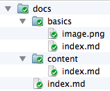

From: Rui Carmo
Date: 2014-10-04 09:17:00
Title: Content Basics

## Files and Folders

Sushy expects you to organize your content _using a folder per page_ with an "index" document inside. The folder path determines the URL it's published under (so you get "nice" URLs by default), and this makes it easy to manage media assets on a per-post basis:




## Markup Languages

Sushy supports Markdown, Textile, raw HTML and ReStructuredText, and determines which markup processor to use based on:

1. The file extension (`index.md`, `index.textile`, `index.rst`, etc.)
2. An (optional) `Content-Type` header (in case you need to override the default)


## Front Matter

Your index document must start with a set of metadata headers. Sushy isn't picky about anything except that header names should be followed by a colon and that the first blank line separates them from the body text:

```text
From: Rui Carmo
Date: 2014-10-04 09:24:00
Title: Test post
Content-Type: text/x-markdown

## Content Heading

Body text
```

### Recognized Headers

Sushy looks for the following headers:

* `Content-Type` - allows you to override the markup language in use
* `Date` - the original publishing date for your post. If missing, the file modification time is used.
* `From` - the author name
* `Index` - set this to `no` or `off` to remove a page from the full text index
* `Last-Modified` - lets you override the file modification time explicitely and trumps the date for insertion in RSS feeds
* `Title` - your page/post title

Headers are case-insensitive, and Sushy will take posts written for [Jekyll][j] and simply ignore the triple dashes (as well as things like `layout`, at least for the moment):

```text
---
layout: post
title: Blogging Like a Hacker
---
```

[j]: http://jekyllrb.com
